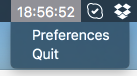

# togglord
Simple OS X Menu Bar utility which displays weekly [toggl](https://toggl.com) summary for a selected project.

This project uses the following libraries:
* [Alamofire](https://github.com/Alamofire/Alamofire) - _Elegant HTTP Networking in Swift_
* [RxSwift](https://github.com/ReactiveX/RxSwift) - _Reactive Programming in Swift_
* [SwiftyJSON](https://github.com/SwiftyJSON/SwiftyJSON) - _The better way to deal with JSON data in Swift_

## Usage

After first run, open `Preferences` from the context menu, enter your toggl API token (from [toggl web site -> my profile](https://www.toggl.com/app/profile)) and select a project for which time summary will be displayed.

## Building

togglord uses [Carthage](https://github.com/carthage/carthage) to manage framework dependencies. 
Run `carthage update` before opening `Togglord.xcodeproj`
